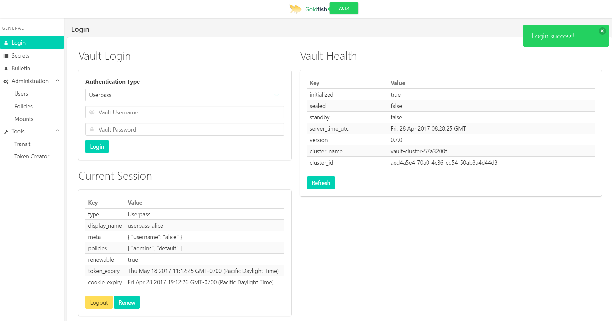
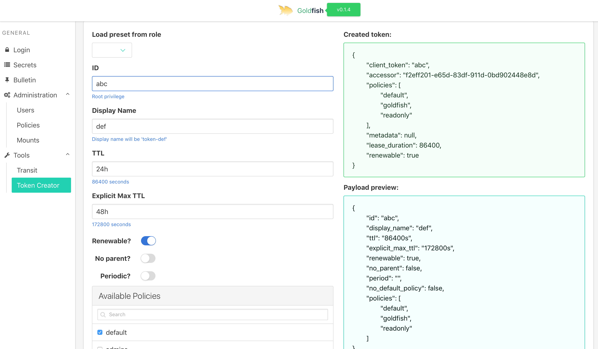
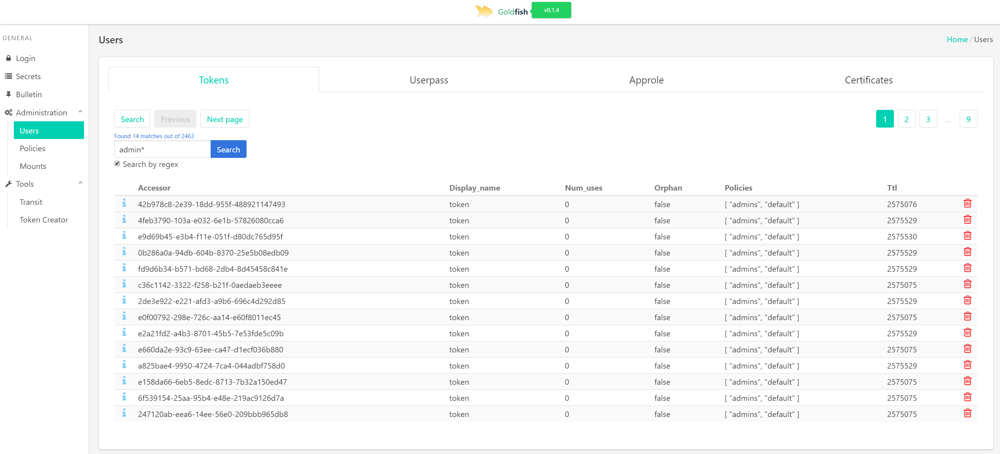
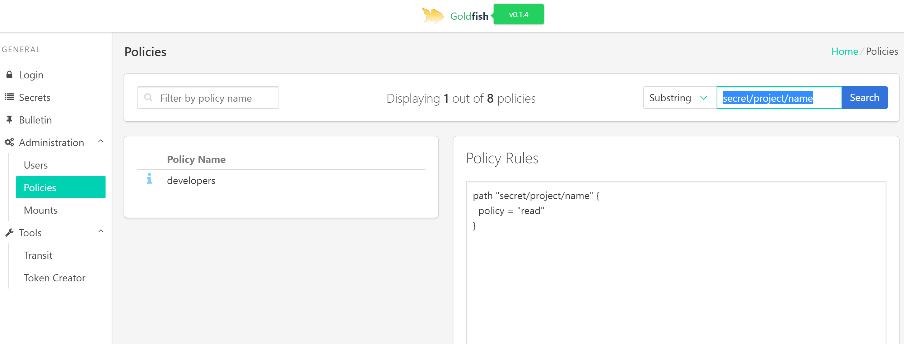

<div align="center">

<h3>Goldfish Vault UI - <a href="http://67.205.184.214:8000">Live Demo</a></h3>

<p></p>

<h3>Show support for development by starring this repo!</a></h3>

</div>

## What is this?

[Goldfish](http://67.205.184.214:8000) is a UI for [HashiCorp Vault](https://www.vaultproject.io)

Although Vault's REST API is powerful, certain operations would benefit from a visual representation.

<!--
-->
## Features

* [x] Hot-loadable server settings from a provided vault endpoint
* [x] Displaying a vault endpoint as a 'bulletin board' in homepage
* [x] **Logging in** with token, userpass, or github
* [x] **Secret** Reading/editing/creating/listing
* [x] **Auth** Searching/creating/listing/deleting
* [x] **Mounts** Listing
* [x] **Policies** Searching/Listing
* [x] Encrypting and decrypting arbitrary strings using transit backend

#### Planned major features: Soon<sup>TM</sup>
* [x] Searching tokens by policy
	- E.g. Display all tokens that have the policy 'admins'
* [x] Searching policy by rule
	- E.g. Display all policies that can access 'secret/data*'
* [ ] Displaying a server audit log in real-time
	- Authorization would be mapped to a (configurable) policy name
* [ ] Request & approval based policy/mount changes
	- Users can place a policy change request in vault
	- Admins must then provide unseal tokens for that specific request
	- Upon reaching a set number, goldfish generates a root token, performs edit, and revokes the root token
* [ ] Resource dependency chain
	- E.g. Will removing a particular policy affect current users?
* [ ] SAML to LDAP integration
* [ ] Secret backend specific tools (e.g. AWS backend)


<!--
-->
## Screenshots













<!--
-->
## Installation

#### Running locally
You'll need go (v1.8), npm (>=3), and nodejs (>=5).

```bash
# you'll need a vault instance
vault server -dev &

# this transit key is needed to encrypt/decrypt user credentials
vault mount transit
vault write -f transit/keys/goldfish

# see vagrant/policies/goldfish.hcl for the required policy.
# transit key is not changable, but the secret path containing run-time settings can be changed
vault policy-write goldfish vagrant/policies/goldfish.hcl

# goldfish launches strictly from approle, because passing a token that humans can see would be silly
vault auth-enable approle
vault write auth/approle/role/goldfish role_name=goldfish secret_id_ttl=5m token_ttl=480h \
token_max_ttl=720h secret_id_num_uses=1 policies=default,goldfish
vault write auth/approle/role/goldfish/role-id role_id=goldfish

# run-time settings can be stored wherever you like,
# just make sure to change it in the policy and the launch cmd arg
vault write secret/goldfish DefaultSecretPath="secret/" TransitBackend="transit" \
UserTransitKey="usertransit" ServerTransitKey="goldfish" BulletinPath="secret/bulletins/"
# explanations on what each key means: https://github.com/Caiyeon/goldfish#configuration

# build the backend server
go get github.com/caiyeon/goldfish
cd $GOPATH/src/github.com/caiyeon/goldfish
go build server.go

# run backend server with secret_id generated from approle
./server -addr http://127.0.0.1:8200 \
-approle_path auth/approle/login \
-config_path secret/goldfish \
-role_id goldfish \
-token $(vault write -f -wrap-ttl=20m -format=json auth/approle/role/goldfish/secret-id | jq -r .wrap_info.token)

# run frontend in dev mode (with hot reload)
cd frontend
npm install
npm run dev

# a browser window/tab should open, pointing directly to goldfish

# for production instances, change server.go to start an https server
# (certbot, self-signed, or provided certificate)
```


#### Using a VM
While go and npm works decently on Windows, there is a one-line solution to spinning up a VM which will contain a dev vault instance and goldfish with hot-reload.

You'll need [Vagrant](https://www.vagrantup.com/downloads.html) and [VirtualBox](https://www.virtualbox.org/). On Windows, a restart after installation is needed.

```bash
# if you wish to launch goldfish in a VM:
git clone https://github.com/Caiyeon/goldfish.git
cd goldfish/vagrant

# this will take awhile
vagrant up --provision

# open up localhost:8001 in chrome on your local machine. You can login with token 'goldfish'
```


#### Configuration
Goldfish reads most of its configuration details from a provided vault endpoint (set by a cmd line arg `config_path` when launching the server)

There are several keys that are used:

`DefaultSecretPath`: the path that is loaded by default on Secrets page

`TransitBackend`: the transit backend that goldfish will use for encryption/decryption

`ServerTransitKey`: the key in `TransitBackend` used to encrypt/decrypt user credentials. Control this tightly (preferably, only allow goldfish to access this)

`UserTransitKey`: the key in `TransitBackend` used by Transit page. Individual users must be granted access to this in order to use the tool.


<!--
-->
## Development
Goldfish is being actively maintained (with new features every 1-2 weeks).

Contributions are welcomed. Feel free to pick up an issue and make a pull request, or open a new issue for a feature enhancement.

The Vagrant setup should provide a consistent dev environment.


<!--
-->
## Components

Frontend:
* VueJS
* Bulma CSS
* Vue Admin

Backend:
* [Vault API](https://godoc.org/github.com/hashicorp/vault/api) wrapper


<!--
-->
## Design

User credentials are always encrypted using [transit backend](https://www.vaultproject.io/docs/secrets/transit/), and will never remain unencrypted at rest (both server and client-side). Cipher is then sent as an unforgeable [secure cookie](http://www.gorillatoolkit.org/pkg/securecookie)

Any future actions from the user will be verified by decrypting the user's cookie with the [transit backend](https://www.vaultproject.io/docs/secrets/transit/) before being validated and used for the action.

Any actions performed (except user credential encryption/decryption via transit) will **only** be done using the user's credentials, and never using the goldfish server's token. This ensures traceability.

If Vault implements CORS, there is a possibility of goldfish becoming serverless, and being shipped as a desktop application using electron.


<!--
-->
## Why 'Goldfish'?

This server should behave as a goldfish, forgetting everything immediately after a request is completed. That, and other inside-joke reasons.