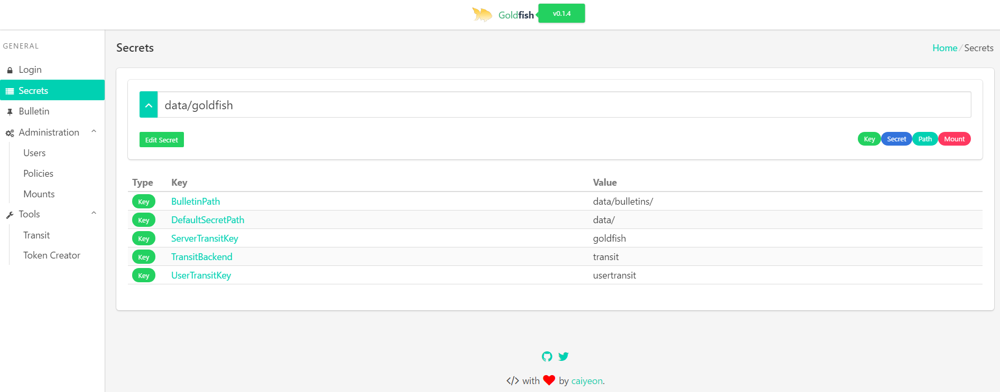
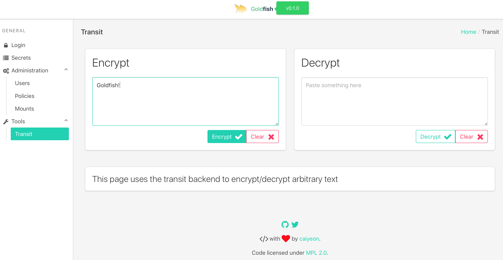

<div align="center">

<h3>Goldfish Vault UI - <a href="http://67.205.184.214:8000">Live Demo</a></h3>

<p></p>

</div>

## What is this?

[Goldfish](http://67.205.184.214:8000) is a UI for [HashiCorp Vault](https://www.vaultproject.io)

Although Vault's REST API is powerful, certain operations would benefit from a visual representation.

<!--
-->
## Features

* [x] Hot-loadable server settings from a provided vault endpoint
* [x] Logging in with token or userpass
* [x] Reading/editing/creating/listing secrets
* [x] Listing/deleting users (tokens, userpass, and approle)
* [x] Listing policies
* [x] Listing and tuning mounts
* [x] Encrypting and decrypting arbitrary strings using transit backend

#### Planned features: Soon<sup>TM</sup>

* [ ] Displaying a vault endpoint as a 'bulletin board' in homepage
* [ ] Logging in with GitHub
* [ ] User creation
* [ ] Displaying a masked server audit log in real-time
* [ ] Secret backend specific tools (e.g. AWS backend)

<!--
-->
## Screenshots








<!--
-->
## Components

Frontend:
* VueJS
* Bulma CSS
* Vue Admin

Backend:
* [Vault API](https://godoc.org/github.com/hashicorp/vault/api) wrapper

<!--
-->
## Design

User credentials are always encrypted using [transit backend](https://www.vaultproject.io/docs/secrets/transit/), and will never remain unencrypted at rest (both server and client-side). Cipher is then sent as an unforgeable [secure cookie](http://www.gorillatoolkit.org/pkg/securecookie)

Any future actions from the user will be verified by decrypting the user's cookie with the [transit backend](https://www.vaultproject.io/docs/secrets/transit/) before being validated and used for the action.

Any actions performed (except user credential encryption/decryption via transit) will **only** be done using the user's credentials, and never using the goldfish server's token. This ensures traceability.

If Vault implements CORS, there is a possibility of goldfish becoming serverless, and being shipped as a desktop application using electron.

<!--
-->
## Installation

#### Running locally
You'll need go (v1.8), npm (>=3), and nodejs (>=5).

```bash
# you'll need a vault instance
vault server -dev &

# see vagrant/provision/vault.sh for setup data to populate vault with

# build the backend server
go get github.com/caiyeon/goldfish
cd $GOPATH/src/github.com/caiyeon/goldfish
go build server.go

# run backend server with secret_id generated from approle
server -token=$(vault write -f -wrap-ttl=20m -format=json \
auth/approle/role/goldfish/secret-id | \
jq -r .wrap_info.token)

# run frontend in dev mode (with hot reload)
cd frontend
npm install
npm run dev

# a browser window/tab should open, pointing directly to goldfish
```


#### Using a VM
While go and npm works decently on Windows, there is a one-line solution to spinning up a VM which will contain a dev vault instance and goldfish with hot-reload.

You'll need [Vagrant](https://www.vagrantup.com/downloads.html) and [VirtualBox](https://www.virtualbox.org/). On Windows, a restart after installation is needed.

```bash
# if you wish to launch goldfish in a VM:
git clone https://github.com/Caiyeon/goldfish.git
cd goldfish/vagrant

# this will take awhile
vagrant up --provision

# open up localhost:8001 in chrome on your local machine. You can login with token 'goldfish'
```


<!--
-->
## Development
Goldfish is being actively maintained (with new features every 1-2 weeks).

Contributions are welcomed. Feel free to pick up an issue and make a pull request, or open a new issue for a feature enhancement.

The Vagrant setup should provide a consistent dev environment.

